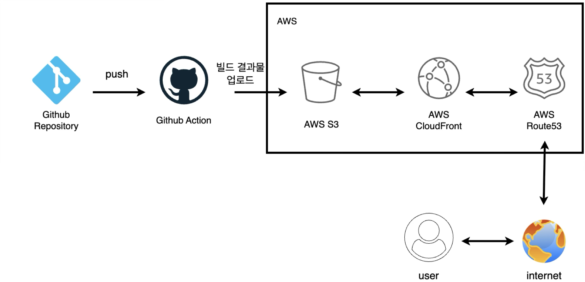
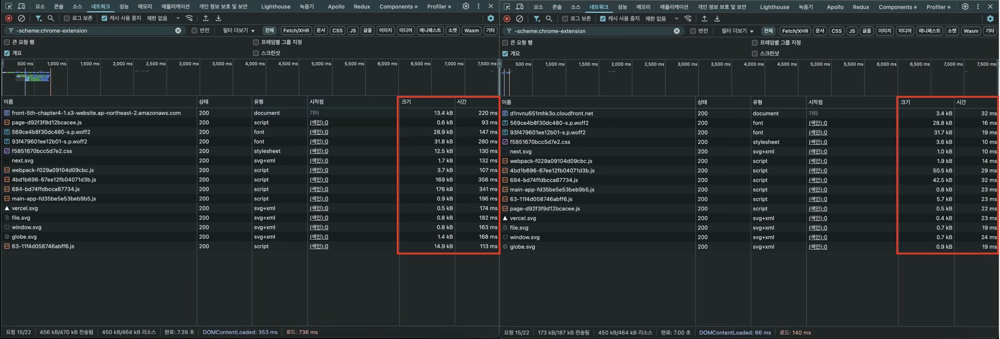
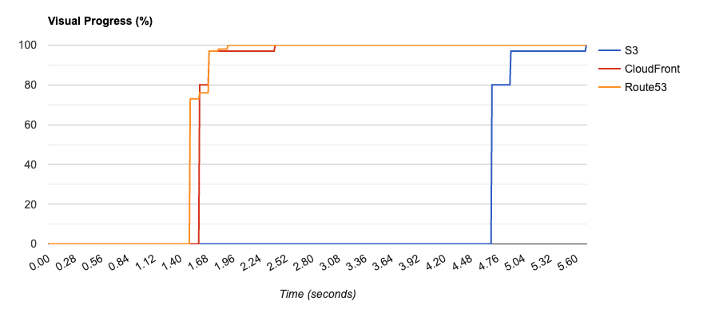
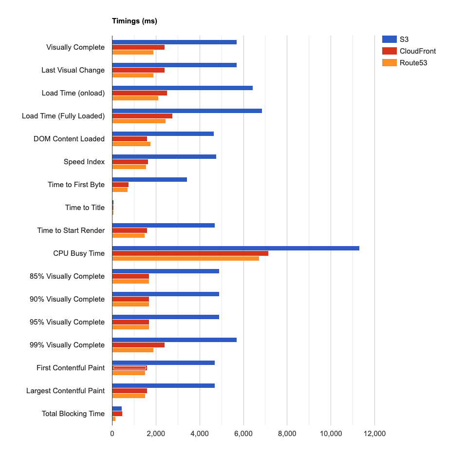
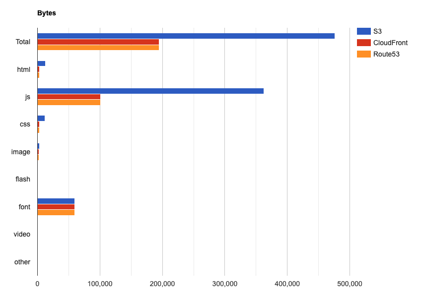
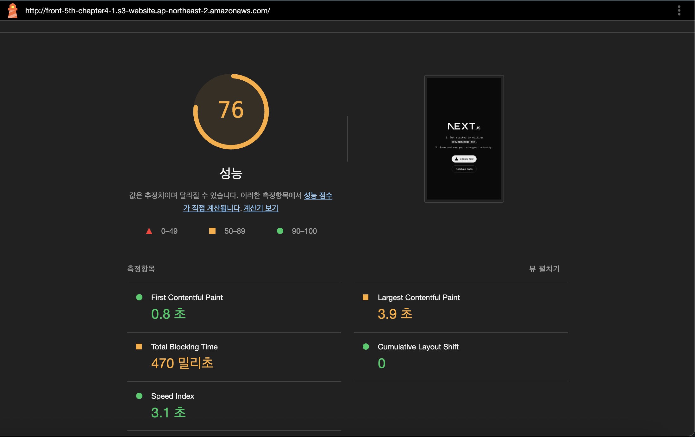
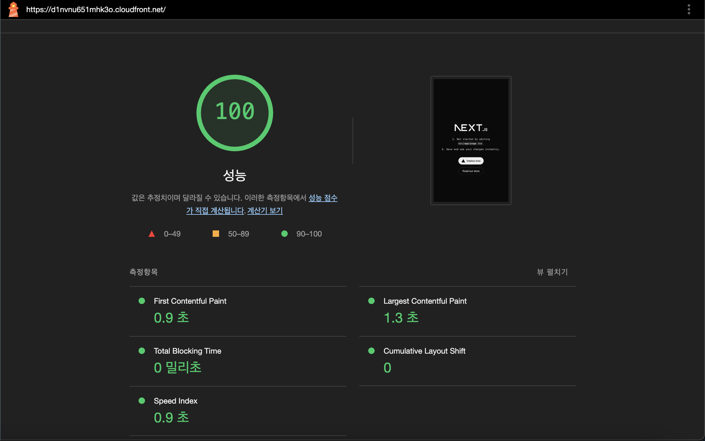
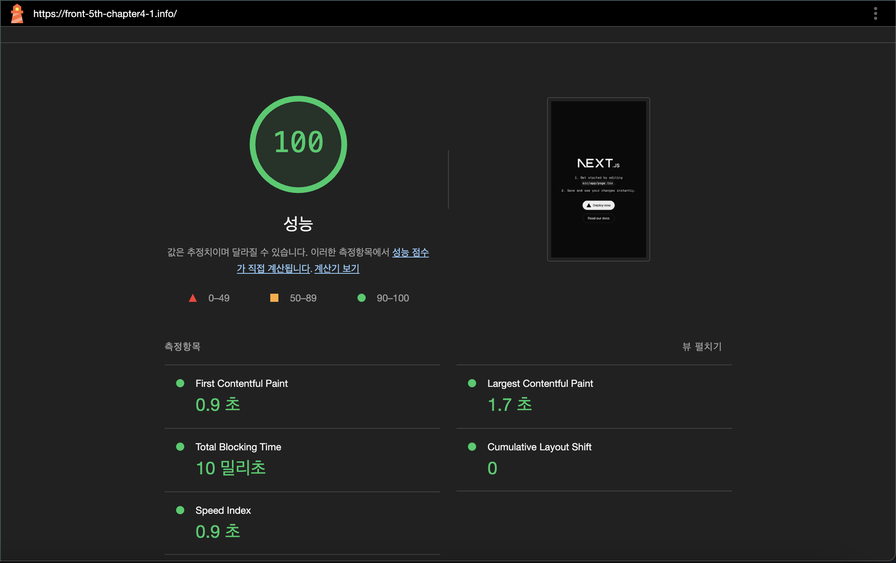

# Chapter 4-1. 인프라 관점의 성능 최적화

## 학습 목표

**기본 과제**

> GitHub과 AWS를 사용해 CDN이 적용된 프론트엔드 프로젝트 CI/CD 파이프라인을 구성합니다.

**심화 과제**

> 인프라 레벨 최적화, 특히 CDN을 사용한 최적화를 이해하고 성능 개선을 위한 사전 작업인 ‘모니터링’을 준비합니다.

## 주요 링크

- S3 버킷 웹사이트 EP: http://front-5th-chapter4-1.s3-website.ap-northeast-2.amazonaws.com/
- CloutFront 배포 도메인: https://d1nvnu651mhk3o.cloudfront.net/
- Route53를 이용한 대체 도메인: https://front-5th-chapter4-1.info/

## 배포 파이프라인

### 개요



1. 저장소 체크아웃
2. `npm ci`: `package-lock.json` 파일 기반으로 프로젝트 의존성을 정확하고 빠르게 설치.
3. `npm run build`: 프로젝트 빌드
4. 저장소 Secrets에 저장된 정보를 토대로 AWS 서비스에 접근할 수 있도록 자격 증명 설정.
5. 프로젝트 빌드 결과물 디렉토리(out) 내용을 S3 버킷에 동기화. `--delete` 옵션은 디렉토리에는 없지만 버킷에는 있는 파일을 삭제하여 빌드 결과물과 버킷 내용을 정확히 일치시킴.
6. CloudFront 배포 ID를 대상으로 캐시를 무효화하여 변경 사항이 즉시 적용되도록 반영.

### S3 버킷 웹사이트, CloutFront 배포 도메인, Route53 대체 도메인 비교



> 좌측은 S3 버킷 웹사이트, 우측은 CloutFront 배포 도메인. 용량과 시간에서 큰 차이를 보인다.


> 좌측은 CloutFront 배포 도메인, 우측은 Route53 대체 도메인. 용량과 시간이 대동소이하다.

네트워크 탭을 통한 비교 외에 다른 방법은 없을까 찾아보았고 몇 가지 방법들을 더 찾아서 아래에 정리했습니다.

### WebPageTest.org를 통한 비교

#### 👀 Visual Progress



- CloudFront / Route53는 1.6~2.0초 내에 100% 렌더링 완료
- S3는 5초가 넘어서야 완전히 로드됨 → 차이가 매우 큼
- Route53과 CloudFront가 동일한 선형 그래프를 가지는 이유는 동일한 CloudFront를 백엔드로 두었기 때문임.

> 📌 CloudFront를 사용할 경우 시각적으로 빠른 피드백을 제공할 수 있고, 유저 체감 성능이 월등히 향상됨.

#### 🔋 Timings



- Time to First Byte (TTFB): S3는 느리고 CloudFront는 빠름 (CDN 캐시 영향)
- Start Render / First Contentful Paint / LCP 모두 S3가 현저히 느림
- Load Time / Visually Complete 역시 S3는 평균 5초 이상, CF는 2초 이내
- CPU Busy Time: S3가 훨씬 길다 → 리소스 최적화가 덜 되어 있음
- Speed Index: CloudFront가 가장 낮음 → “빠르게 보이는 정도”가 가장 뛰어남

> 📌 CloudFront를 붙이면 초기 응답부터 콘텐츠 렌더, 사용자 체감 속도 전반이 좋아짐. S3 단독은 성능 병목이 명확함.

#### 🪣 Bytes



- S3는 JS, HTML, Font 등을 모두 거의 2배 가량 더 많이 전송
- CloudFront, Route53은 용량이 절반가량 줄어 있음
  - 이유: 압축 및 캐시 최적화, 중복 자산 제거, 헤더 최적화 등 CDN의 이점

> 📌 CloudFront는 압축을 통해 동일한 콘텐츠를 더 작고 빠르게 전송 → 네트워크 비용 절감 + 사용자 경험 개선

### Chrome Devtools LightHouse







(설명 TBD)

## 기술적 성장

### `npm install` vs `npm ci`

npm ci는 처음 접해봤습니다. ci가 continuous integration의 약자인 것은 쉽게 추론이 가능했고 스크립트 내에서의 위치로 의존성을 설치하는거구나 눈치를 채긴 했지만 기능의 정확한 동작이나 npm install 과의 차이는 모르기 때문에 정리를 했습니다.

1. npm install

- package.json을 기반으로 의존성을 설치함.
- package-lock.json이 있으면 이를 참고하지만, 새로 생기거나 바뀔 수 있음.
- node_modules를 유지하며 증분 설치 가능.
- 로컬 개발 중 새로운 패키지를 추가할 때 사용.
- 잠재적으로 node_modules가 lock file과 일치하지 않을 수 있음.

2. npm ci

- package-lock.json을 정확하게 따름.
- node_modules 폴더가 완전히 삭제되고 재설치됨.
- package-lock.json과 package.json이 일치하지 않으면 실패함.
- CI/CD 환경이나 재현 가능한 빌드가 필요할 때 사용함.
- 빠르고 일관된 설치를 보장함.

#### ✅ 요약

| 항목                              | `npm install`                             | `npm ci`                                |
| --------------------------------- | ----------------------------------------- | --------------------------------------- |
| **용도**                          | 개발 및 일반 설치                         | CI/CD, 자동화 환경                      |
| **속도**                          | 상대적으로 느림                           | 더 빠름                                 |
| **`package-lock.json` 사용 여부** | 선택적 (존재 시 반영하되, 덮어쓰기도 함)  | 반드시 필요하며, **엄격하게** 따름      |
| **파일 일관성 보장**              | 낮음 (버전 차이 가능성 존재)              | 높음 (lock 파일 기반으로 정확하게 설치) |
| **노드 모듈 삭제**                | 하지 않음                                 | **`node_modules` 폴더 삭제 후 재설치**  |
| **수정 가능성**                   | `package-lock.json`이 수정될 수 있음      | 수정되지 않음                           |
| **호환성 검사**                   | `package.json`과 lock 파일 불일치 시 경고 | 불일치 시 **설치 실패**                 |

#### 🛠 언제 무엇을 써야 할까?

| 상황                                                              | 추천 명령어   |
| ----------------------------------------------------------------- | ------------- |
| 로컬에서 패키지를 추가/업데이트하거나 실험할 때                   | `npm install` |
| CI/CD 파이프라인에서 안정적으로 재현 가능한 환경을 만들고 싶을 때 | `npm ci`      |
| 새로운 팀원이 프로젝트를 셋업할 때 (일관된 환경이 필요함)         | `npm ci`      |

#### 👍 대응 되는 명령어

| 패키지 매니저      | 일반 설치      | CI 전용 설치                     |
| ------------------ | -------------- | -------------------------------- |
| **npm**            | `npm install`  | `npm ci`                         |
| **Yarn (v1)**      | `yarn install` | `yarn install --frozen-lockfile` |
| **Yarn (v2 이상)** | `yarn install` | `yarn install --immutable`       |
| **pnpm**           | `pnpm install` | `pnpm install --frozen-lockfile` |

### 캐시 무효화의 중요성과 시점

배포 스크립트 내에서는 S3에 빌드 결과물을 올린 뒤에 캐시 무효화를 진행하고 있다.

```bash
- name: Deploy to S3
  run: |
    aws s3 sync out/ s3://${{ secrets.S3_BUCKET_NAME }} --delete

- name: Invalidate CloudFront cache
  run: |
    aws cloudfront create-invalidation --distribution-id ${{ secrets.CLOUDFRONT_DISTRIBUTION_ID }} --paths "/*"
```

#### 🔄 다른 상황에서는 언제 캐시 무효화를 고려해야 할까?

1. 빌드 결과물이 URL 기반으로 고정되지 않은 경우

   > 예: main.js, index.html 등 이름이 동일한 파일이 덮어쓰기 되면서 업데이트되는 경우

   - 무효화 필요
   - 사용자가 캐싱된 asset을 보게 될 가능성 있음

   📍 시점: S3 업로드 직후 또는 CloudFront 배포 완료 이벤트 후 (CI 파이프라인에서 hook 사용)

2. #️⃣ 파일 이름에 해시가 포함된 경우

   > 예: main.abc123.js, style.def456.css 처럼 content hash가 붙는 경우 (Next.js도 가능)

   - 보통 CloudFront 캐시 무효화가 불필요
   - 파일 이름이 바뀌므로 새 URL을 요청하게 됨

   index.html처럼 해시가 없고 항상 같은 이름을 쓰는 파일은 예외적으로 무효화 필요

   📍 시점: index.html과 같이 캐싱되어선 안 되는 파일만 선택적으로 invalidate

3. 🚨 실시간 긴급 대응 시

   > 버그, 오류 이미지, 민감한 파일이 잘못 올라간 경우 등

   - 즉시 수동으로 무효화 필요
   - 사용자는 이미 캐시된 파일을 보고 있을 수 있음

   📍 시점: 문제 원인을 수정한 뒤, 수동으로 invalidate 또는 수동 배포 후 invalidate

### CDN 적용 시 성능 개선 요소

1. ⏳ Latency 감소

   | 항목        | S3 버킷 단독                      | CloudFront(CDN) 사용 시                 |
   | ----------- | --------------------------------- | --------------------------------------- |
   | 사용자 위치 | S3가 위치한 리전에 직접 연결      | 사용자와 가까운 엣지 로케이션에서 응답  |
   | 응답 시간   | 지리적으로 멀면 증가              | 평균적으로 더 빠름 (수십\~수백 ms 단축) |
   | 개선 효과   | ✔ 글로벌 사용자일수록 체감 확실함 |                                         |

   > CloudFront는 사용자 가까운 노드에서 콘텐츠를 서빙해 **첫 바이트 응답 시간(TTFB)** 을 크게 단축시킨다.

2. 🖥️ 브라우저 캐싱 효율 및 TTL 제어

   | 항목      | S3 단독                     | CloudFront                          |
   | --------- | --------------------------- | ----------------------------------- |
   | 캐싱 제어 | 기본적 객체 TTL 설정만 가능 | 경로별, 헤더별 정밀 TTL 제어 가능   |
   | 퍼포먼스  | 모든 요청이 항상 S3로 감    | 자주 보는 파일은 엣지 노드에서 응답 |

   > 자주 조회되는 정적 asset(JS, CSS, 이미지 등)은 CloudFront에서 반복 제공되어 네트워크 병목 없이 빠름.

3. 👨🏻‍🏫 병렬 요청 처리 성능

- CloudFront는 HTTP/2 및 HTTP/3을 기본적으로 지원함
- S3 웹호스팅은 HTTP/1.1 기반이 많고 최적화 미흡

  > CloudFront는 병렬 요청 및 헤더 압축에 최적화되어 있어 초기 페이지 로드 시간이 단축됨

4. 😷 오리진 서버 보호 및 리소스 절약

   | 항목        | S3 단독               | CloudFront                                  |
   | ----------- | --------------------- | ------------------------------------------- |
   | 트래픽 부담 | 모든 요청이 S3에 집중 | 인기 리소스는 CF에서 응답, 오리진 요청 감소 |
   | 원본 보호   | ❌ 없음               | ✔ CF에서 DoS 완화 및 요청 제한 가능         |

   > 트래픽 급증 시에도 S3의 부하를 최소화할 수 있어 안정성 향상과 비용 절감 효과 있음

5. 🔐 TLS/HTTPS 성능 및 보안 향상

- CloudFront는 TLS 연결 재사용, 0-RTT 지원(HTTP/3) 등 최신 보안 기술로 HTTPS 응답을 최적화
- S3 웹사이트 엔드포인트는 HTTPS를 직접 지원하지 않음 → 별도 ALB나 CloudFront 필요

  > HTTPS를 사용할 경우, CloudFront가 보안 + 성능 모두에서 우위

## 학습 효과

## 과제 피드백

1. 😄 좋았던 점

   몇 년 전에 개인 블로그를 이번 과제와 동일하게 S3, CloudFront, Route53을 이용하여 배포해본 경험이 있습니다. 그 때의 취지 또한 이번 과제와 마찬가지로 최소한의 기본적인 인프라 지식 함양과 AWS 운용 방법 익히기였기 때문에 Vercel이나 Github를 이용해서 쉽게 가는 방식은 택하지 않았습니다. 그 과정에서 잘 몰랐던 네트워크 개념들이 많아서 많이 헤매기도 했고 리프레쉬를 할 때마다 블로그가 터지는 경험을 겪기도 했고 인증서 갱신을 깜빡해서 날리기도 했습니다.

   가이드가 워낙 잘 되어 있기도 하고 이미 경험을 해보기도 해서 과제를 수행할 때 잘 몰라서 해매거나 어려움을 겪는 부분은 없었습니다. 그러나 이전에 블로그를 만들 땐 실용적인 측면(직접 AWS를 운용하는)에서 접근해서 뭐가 더 나아진다는 것을 딱히 면밀하게 확인하진 않았습니다.

   그래서 이번에는 과제가 전달하고자 하는 **인프라 관점의 성능 최적화** 에 좀 더 집중하여 어떤 점들이 개선되는지, 무엇이 더 나아질 수 있는 여지가 남았는지, 다른 방식으로 성능을 개선할 수 있는 방법은 무엇인지 공부할 시간과 기회가 충분히 주어져서 좋습니다. 그리고 또 한참 전에 쓰고 사용하지 않았던 AWS를 다시 건드려보고 리마인드 할 수 있어서 만족합니다!

2. 😔 아쉬운 점

   과제의 가이드라인이 잘 잡혀있어서 따라하기만 하면 되기 때문에 난이도가 그렇게 높다고 느껴지지는 않았습니다. 좀 더 어려워도 되지 않았을까? 라는 생각이 들긴 합니다. 가산점을 받을 수 있는 포인트라던가 기본까지 다 했다면 이런거까지 해보면 좋다는 것도 제안되어 챌린지의 성격이 좀 더 강해지면 좋을 것 같습니다!
