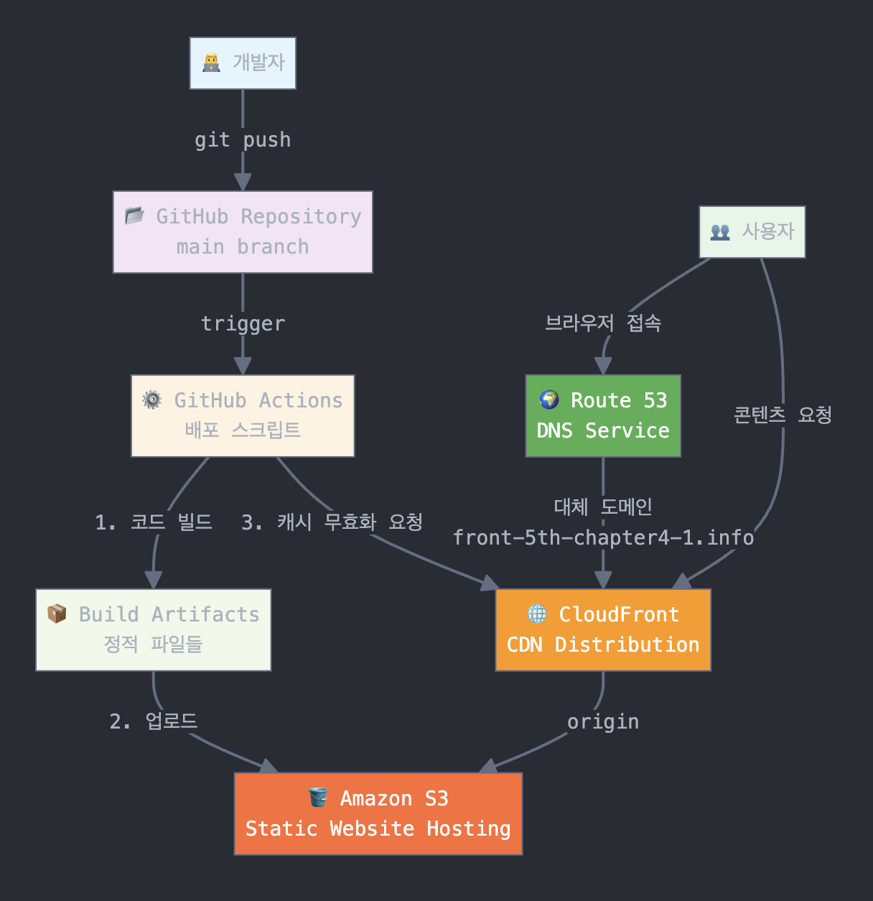
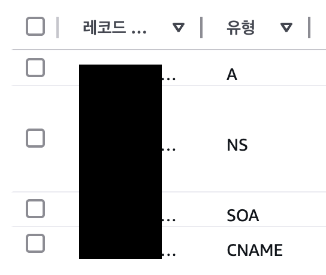

# Chapter 4-1. 인프라 관점의 성능 최적화

## 목차

- [1. 학습 목표](#-1-학습-목표)
- [2. 주요 링크](#-2-주요-링크)
- [3. 배포 파이프라인](#-3-배포-파이프라인)
- [4. 배포 프로세스 정리](#-4-배포-프로세스-정리)
- [5. 주요 개념 정리](#-5-주요-개념-정리)
- [6. 성능 최적화 분석 보고서](#-6-성능-최적화-분석-보고서)
- [7. 그 외에 배운 것](#-7-그-외에-배운-것)
- [8. 과제 피드백](#-8-과제-피드백)

## 🎯 1. 학습 목표

**기본 과제**

> GitHub과 AWS를 사용해 CDN이 적용된 프론트엔드 프로젝트 CI/CD 파이프라인을 구성합니다.

**심화 과제**

> 인프라 레벨 최적화, 특히 CDN을 사용한 최적화를 이해하고 성능 개선을 위한 사전 작업인 ‘모니터링’을 준비합니다.

## 🔗 2. 주요 링크

- S3 버킷 웹사이트 EP: http://front-5th-chapter4-1.s3-website.ap-northeast-2.amazonaws.com/
- CloutFront 배포 도메인: https://d1nvnu651mhk3o.cloudfront.net/
- Route53를 이용한 대체 도메인: https://front-5th-chapter4-1.info/

## 🏛️ 3. 배포 파이프라인




## 🧹 4. 배포 프로세스 정리

### (1) 저장소 체크아웃

저장소의 코드를 Actions runner로 가져온다.

```bash
- name: Checkout repository
  uses: actions/checkout@v4
```

### (2) 프로젝트 의존성 설치

`npm ci` 명령어를 통해 `package-lock.json` 기반으로 프로젝트 의존성을 설치한다.

```bash
- name: Install dependencies
  run: npm ci
```

### (3) 프로젝트 빌드

`npm run build` 명령어를 통해 Next.js 프로젝트를 프로덕션용으로 빌드하여 `out` 디렉토리에 정적 파일들을 생성한다.

```bash
- name: Build
  run: npm run build
```

### (4) AWS 자격 증명 획득

저장소 Secrets에 저장된 `AWS_ACCESS_KEY_ID`, `AWS_SECRET_ACCESS_KEY`, `AWS_REGION` 정보를 바탕으로 AWS CLI와 SDK를 사용할 수 있도록 자격을 인증한다.

```bash
- name: Configure AWS credentials
  uses: aws-actions/configure-aws-credentials@v1
  with:
    aws-access-key-id: ${{ secrets.AWS_ACCESS_KEY_ID }}
    aws-secret-access-key: ${{ secrets.AWS_SECRET_ACCESS_KEY }}
    aws-region: ${{ secrets.AWS_REGION }}
```

### (5) S3에 빌드 결과물 업로드

프로젝트 빌드 결과물 디렉토리(out) 내용을 S3 버킷에 동기화한다. `--delete` 옵션은 디렉토리에는 없지만 버킷에는 있는 파일을 삭제하여 빌드 결과물과 버킷 내용을 정확히 일치시킨다.

```bash
- name: Deploy to S3
  run: |
    aws s3 sync out/ s3://${{ secrets.S3_BUCKET_NAME }} --delete
```

### (6) CloudFront 캐시 무효화

CloudFront 배포 ID를 대상으로 캐시를 무효화하여 변경 사항이 즉시 적용되도록 반영한다.

```bash
- name: Invalidate CloudFront cache
  run: |
    aws cloudfront create-invalidation --distribution-id ${{ secrets.CLOUDFRONT_DISTRIBUTION_ID }} --paths "/*"
```

## 📚 5. 주요 개념 정리

### (1) GitHub Actions와 CI/CD 도구

#### ❓ GitHub Actions

- GitHub Actions는 GitHub에서 제공하는 CI/CD 도구. 저장소 내의 `.github/workflows/*.yml` 파일을 기반으로 코드 푸시나 PR 생성/수정 등의 이벤트를 트리거로 삼아서 자동으로 워크플로우를 실행한다.

#### ❓ CI/CD

- CI(Continuous Integration): 지속적 통합이라고 한다. 코드 병합 시에 자동으로 빌드와 테스트를 수행하여 변경점을 검증하고 코드의 품질을 유지한다.
- CD(Continuous Deployment): 지속적 배포라고 한다. 빌드된 결과물을 자동으로 배포하는 것을 말한다.

### (2) 스토리지와 S3

#### ❓ S3

- **Amazon S3 (Simple Storage Service)** 는 AWS에서 제공하는 객체 스토리지 서비스.
- 정적 파일(HTML, JS, 이미지, JSON 등)을 URL 기반으로 접근 가능하게 저장함.
- 용도에 따라 웹 호스팅, 백업, 로그 저장소로 사용됨.

**스토리지 서비스 정리**

| 클라우드                | 서비스명              | 특징                                                               |
| ----------------------- | --------------------- | ------------------------------------------------------------------ |
| **AWS**                 | **S3**                | 업계 표준 객체 스토리지, 다양한 스토리지 클래스로 비용 최적화 가능 |
| **GCP**                 | **Cloud Storage**     | S3와 거의 유사한 객체 저장, multi-region 제공                      |
| **Azure**               | **Blob Storage**      | block, append, page blob 등 제공. Hot/Cool/Archive 계층 제공       |
| **Cloudflare**          | **R2**                | S3 호환, **egress 비용 없음**, Cloudflare Workers와 연동 용이      |
| **DigitalOcean**        | **Spaces**            | S3 호환 API, 간편한 UI, 소규모 프로젝트에 적합                     |
| **Backblaze**           | **B2 Cloud Storage**  | S3 호환, 저렴한 요금, 고정 콘텐츠 저장용에 적합                    |
| **Wasabi**              | **Hot Cloud Storage** | 저렴하고 빠른 스토리지, egress 무료 정책이 강점                    |
| **MinIO (자체 호스팅)** | **MinIO**             | S3 API 호환, 온프레미스 구축 가능, 경량 경로에 적합                |

### (3) CDN과 CloudFront

#### ❓ CDN

- Content Delivery Network의 약자. 전 세계에 분산된 엣지 로케이션 서버를 통해 사용자가 요청한 정적 리소스를 가장 가까운 서버에서 빠르게 전송할 수 있도록 하는 기술.
- CDN에서 압축은 옵셔널한 정책이고 CloudFront를 포함한 일부 CDN은 설정에 따라 자동 압축을 지원함.

#### ❓ CloudFront

- CloudFront는 AWS가 제공하는 CDN 서비스이다.
- 정적 리소스를 전 세계적으로 빠르게 제공 (레이턴시 단축)
- S3 origin 보호 가능 (CloudFront 외 요청 차단)
- HTTPS 인증서 제공 (무료 SSL)
- 사용량 기반 요금으로 트래픽 최적화

**CDN 서비스 정리**

| 클라우드/업체  | CDN 서비스명            | 특징                                                                   |
| -------------- | ----------------------- | ---------------------------------------------------------------------- |
| **AWS**        | **CloudFront**          | AWS 전역 인프라 기반, S3/EC2와 자연스럽게 연동됨                       |
| **GCP**        | **Cloud CDN**           | Google 글로벌 백본 이용, GCS, App Engine 등과 통합                     |
| **Azure**      | **Azure CDN**           | Akamai/Verizon 기반 선택 가능, Blob Storage와 통합                     |
| **Cloudflare** | **CDN**                 | 전 세계 300개 이상 엣지, **무료 플랜**에서도 빠른 응답, DDoS 방어 탁월 |
| **Fastly**     | **Fastly CDN**          | 실시간 캐시 제어, 동적 콘텐츠 처리에 강점, VCL 스크립팅                |
| **Akamai**     | **Ion/CDN**             | 세계 최대 규모의 CDN, 엔터프라이즈에 특화                              |
| **Netlify**    | **Netlify Edge**        | 정적 웹사이트 호스팅 + CDN + CI/CD 통합 제공                           |
| **Vercel**     | **Vercel Edge Network** | Next.js 친화적, 자동 CDN 배포 및 라우팅 최적화                         |

### (4) 캐시 무효화

#### ❓ 정의

캐시에 저장된 데이터가 더 이상 유효하지 않을 때, 그것을 삭제하거나 새 데이터로 갱신하는 과정.

#### 🏹 목적

최신 정보로 갱신하여 사용자에게 오래된 정보가 노출되지 않도록 하기 위함.

#### 캐시 무효화의 중요성과 시점

배포 스크립트 내에서는 S3에 빌드 결과물을 올린 뒤에 캐시 무효화를 진행하고 있다.

```bash
- name: Deploy to S3
  run: |
    aws s3 sync out/ s3://${{ secrets.S3_BUCKET_NAME }} --delete

- name: Invalidate CloudFront cache
  run: |
    aws cloudfront create-invalidation --distribution-id ${{ secrets.CLOUDFRONT_DISTRIBUTION_ID }} --paths "/*"
```

보통 웹에서는 캐시를 이용하고 있기 때문에 변경이 바로 갱신되지 않을 수 있다. 그렇기 때문에 새 빌드 결과물을 업로드하고 캐시 무효화를 진행하여 새 컨텐츠가 노출되도록 한다.

#### 🧐 캐시 무효화가 필요한 상황

| 상황                     | 예시                                                            |
| ------------------------ | --------------------------------------------------------------- |
| 웹사이트 UI가 변경됨     | 이미지, JS, CSS가 바뀌었지만 브라우저는 이전 버전 캐시를 사용함 |
| API 응답 데이터가 갱신됨 | 사용자 정보가 바뀌었는데 캐시된 JSON 응답을 계속 반환           |
| 배포가 이루어짐          | 새로운 정적 파일이 배포됐지만 CDN은 이전 파일을 계속 제공함     |

#### ⚡️ 캐시 무효화 전략

#1 🔁 만료 기반 무효화

- TTL(Time-To-Live) 설정하여 일정 시간이 지나면 자동으로 캐시가 만료
- 예: `Cache-Control: max-age=3600`

#2 🆕 버전 기반 무효화

- 파일이나 URL에 해시를 포함하거나 버전 값을 붙여서 새 파일로 인식하게 함 #️⃣
- 예: `main.js?v=2`, `app.v20.scss`
- 보통 CloudFront 캐시 무효화 불필요
- 파일명이나 URL 자체가 바뀌므로 항상 새 URL을 요청해서 가장 안정적이고 일반적임

#3 🔥 강제 무효화

- 캐시된 파일을 삭제하거나 덮어쓰기
- 버그, 잘못된 이미지, 민감한 파일 등이 잘못 올라간 경우 🚨
- 보통 수동으루 무효화 처리
- 예: CDN에서 수동으로 무효화

#### ✅ 각 캐시 계층과 무효화 방식

| 계층              | 캐시 예시                 | 무효화 방식                                    |
| ----------------- | ------------------------- | ---------------------------------------------- |
| **브라우저**      | JS, CSS, 이미지 등        | `Cache-Control`, `ETag`, 버전 쿼리스트링       |
| **CDN/프록시**    | CloudFront, Cloudflare    | TTL 설정, 강제 Purge, 파일 이름 변경           |
| **서버**          | Redis, Memory, File cache | Key 삭제, TTL, 조건부 갱신                     |
| **클라이언트 앱** | 모바일/SPA 캐시           | 로컬스토리지 갱신, `useEffect`로 조건부 리페치 |

### (5) Repository secret과 환경변수

#### ❓ Secrets

- GitHub 저장소에 공개적으로 업로드할 수 없는 민감/보안 정보를 저장하는 곳.
- 예시
  - AWS Access Key
  - Firebase API Key
  - DB 비밀번호
  - 배포용 토큰

GitHub Actions에서 `${{ secrets.AWS_ACCESS_KEY_ID }}` 형태로 접근 가능하다.

#### ❓ 환경변수

- 빌드, 배포, 런타임 설정을 환경마다 다르게 하기 위해 사용하는 key-value 포맷의 설정값.
- 예시
  - `BASE_API_PATH=https://api.example.com`
  - `NODE_ENV=development`

### (6) Route53과 Hosted Zone, 레코드

#### ❓ Route53

- Route53은 AWS에서 제공하는 확장 가능한 DNS 서비스.
- 도메인 등록 가능.
- DNS 관리 (Hosted Zone): 도메인의 이름과 IP 주소를 매핑하는 DNS 레코드들을 설정하는 공간
- 트래픽 라우팅: 지리적 위치, 헬스 체크, 지연 시간 등을 기반으로 요청을 특정 엔드포인트로 보낼 수 있음.

#### 📌 Hosted Zone

- 하나의 도메인에 대한 DNS 설정을 관리하는 컨테이너야
- `front-5th-chapter4-1.info` 라는 도메인을 구매했다면, 이 도메인에 대한 레코드들을 저장하는 Hosted Zone이 생긴다.

#### 🎤 Record

- 📘 A 레코드 (Address Record)

  - 도메인 이름 → IPv4 주소로 변환.
  - 예: `example.com` → 192.0.2.1
  - 클라이언트가 이 IP로 바로 요청을 보냄.

- 📘 AAAA 레코드

  - 도메인 이름 → IPv6 주소로 변환.
  - A 레코드와 역할은 같지만 IPv6용.

- 📘 CNAME 레코드 (Canonical Name)

  - 도메인 이름 → 다른 도메인 이름으로 매핑.
  - IP 주소가 아닌 다른 도메인을 참조함.
  - 즉, `www.example.com` 에 요청이 들어오면 `example.com` 으로 리디렉션됨.
  - 최상위 도메인에는 사용할 수 없음.
    - `example.com` 에 CNAME을 설정하면 안 됨. 루트 도메인에는 A 레코드나 ALIAS만 가능함.

- 📘 SOA (Start of Authority)
  - 레코드는 하나의 도메인(또는 zone)의 DNS 권한 정보를 담은 레코드.
  - 즉, "이 도메인은 누구 책임이고, 어떻게 관리되며, 캐시를 언제까지 유지해야 하는가?" 를 정의하는 최상위 메타 정보
  - Route 53은 자동으로 SOA 레코드와 NS 레코드를 생성하며 직접 수정 불가, Hosted Zone 생성 시 자동 포함됨.
  - 도메인을 NS 서버로 연결하려면, SOA의 NS 레코드와 일치해야 함.



| `front-5th-chapter4-1.info` route53에 붙어있는 레코드

#### ✅ Route53에서 작동 방식

1. 사용자가 example.com 입력
2. Route53이 해당 도메인의 Hosted Zone을 조회
3. 가장 알맞은 레코드(A, CNAME, ALIAS 등)를 반환
4. 브라우저가 해당 IP 또는 도메인으로 실제 요청

### CDN 적용 시 성능 개선 요소

1. ⏳ Latency 감소

   | 항목        | S3 버킷 단독                      | CloudFront(CDN) 사용 시                 |
   | ----------- | --------------------------------- | --------------------------------------- |
   | 사용자 위치 | S3가 위치한 리전에 직접 연결      | 사용자와 가까운 엣지 로케이션에서 응답  |
   | 응답 시간   | 지리적으로 멀면 증가              | 평균적으로 더 빠름 (수십\~수백 ms 단축) |
   | 개선 효과   | ✔ 글로벌 사용자일수록 체감 확실함 |                                         |

   > CloudFront는 사용자 가까운 노드에서 콘텐츠를 서빙해 **첫 바이트 응답 시간(TTFB)** 을 크게 단축시킨다.

2. 🖥️ 브라우저 캐싱 효율 및 TTL 제어

   | 항목      | S3 단독                     | CloudFront                          |
   | --------- | --------------------------- | ----------------------------------- |
   | 캐싱 제어 | 기본적 객체 TTL 설정만 가능 | 경로별, 헤더별 정밀 TTL 제어 가능   |
   | 퍼포먼스  | 모든 요청이 항상 S3로 감    | 자주 보는 파일은 엣지 노드에서 응답 |

   > 자주 조회되는 정적 asset(JS, CSS, 이미지 등)은 CloudFront에서 반복 제공되어 네트워크 병목 없이 빠름.

3. 👨🏻‍🏫 병렬 요청 처리 성능

- CloudFront는 HTTP/2 및 HTTP/3을 기본적으로 지원함
- S3 웹호스팅은 HTTP/1.1 기반이 많고 최적화 미흡

  > CloudFront는 병렬 요청 및 헤더 압축에 최적화되어 있어 초기 페이지 로드 시간이 단축됨

4. 😷 오리진 서버 보호 및 리소스 절약

   | 항목        | S3 단독               | CloudFront                                  |
   | ----------- | --------------------- | ------------------------------------------- |
   | 트래픽 부담 | 모든 요청이 S3에 집중 | 인기 리소스는 CF에서 응답, 오리진 요청 감소 |
   | 원본 보호   | ❌ 없음               | ✔ CF에서 DoS 완화 및 요청 제한 가능         |

   > 트래픽 급증 시에도 S3의 부하를 최소화할 수 있어 안정성 향상과 비용 절감 효과 있음

5. 🔐 TLS/HTTPS 성능 및 보안 향상

- CloudFront는 TLS 연결 재사용, 0-RTT 지원(HTTP/3) 등 최신 보안 기술로 HTTPS 응답을 최적화
- S3 웹사이트 엔드포인트는 HTTPS를 직접 지원하지 않음 → 별도 ALB나 CloudFront 필요

  > HTTPS를 사용할 경우, CloudFront가 보안 + 성능 모두에서 우위

## 📝 6. 성능 최적화 분석 보고서

### (1) S3 버킷 웹사이트, CloutFront 배포 도메인, Route53 대체 도메인 네트워크 탭 비교


> 좌측은 S3 버킷 웹사이트, 우측은 CloutFront 배포 도메인. 용량과 시간에서 큰 차이를 보인다.


> 좌측은 CloutFront 배포 도메인, 우측은 Route53 대체 도메인. 용량과 시간이 대동소이하다.

| 측정 지표            | S3    | CF    | Route53 | S3 <-> CF 개선율 |
| -------------------- | ----- | ----- | ------- | ---------------- |
| **총 완료 시간**     | 7.39s | 7.00s | 7.03s   | 5.3% ⬇️          |
| **DOMContentLoaded** | 353ms | 66ms  | 54ms    | 81.3% ⬇️         |
| **로드**             | 736ms | 140ms | 128ms   | 81.0% ⬇️         |
| **전송 크기**        | 456KB | 173KB | 173KB   | 62.1% ⬇️         |
| **리소스 크기**      | 450KB | 450KB | 450KB   | 0%               |

> 엣지 로케이션의 캐싱으로 인해 로드 속도가 개선되었고 리소스가 캐시 서버에 압축 저장되어 전달되었기 때문에 전송 크기가 줄어들었다.

> S3의 경우 전송 크기가 리소스 크기보다 큰데 헤더, 쿠키, 인증 정보 등의 메타데이터가 포함되어서이다.

### (2) WebPageTest.org를 통한 비교

#### 👀 Visual Progress


- CloudFront / Route53는 1.6~2.0초 내에 100% 렌더링 완료
- S3는 5초가 넘어서야 완전히 로드됨 → 차이가 매우 큼
- Route53과 CloudFront가 동일한 선형 그래프를 가지는 이유는 동일한 CloudFront를 백엔드로 두었기 때문임.

> 📌 CloudFront를 사용할 경우 시각적으로 빠른 피드백을 제공할 수 있고, 유저 체감 성능이 월등히 향상됨.

#### 🔋 Timings


- Time to First Byte (TTFB): S3는 느리고 CloudFront는 빠름 (CDN 캐시 영향)
- Start Render / First Contentful Paint / LCP 모두 S3가 현저히 느림
- Load Time / Visually Complete 역시 S3는 평균 5초 이상, CF는 2초 이내
- CPU Busy Time: S3가 훨씬 길다 → 리소스 최적화가 덜 되어 있음
- Speed Index: CloudFront가 가장 낮음 → “빠르게 보이는 정도”가 가장 뛰어남

> 📌 CloudFront를 붙이면 초기 응답부터 콘텐츠 렌더, 사용자 체감 속도 전반이 좋아짐. S3 단독은 성능 병목이 명확함.

#### 🪣 Bytes


- S3는 JS, HTML, Font 등을 모두 거의 2배 가량 더 많이 전송
- CloudFront, Route53은 용량이 절반가량 줄어 있음
  - 이유: 압축 및 캐시 최적화, 중복 자산 제거, 헤더 최적화 등 CDN의 이점

> 📌 CloudFront는 압축을 통해 동일한 콘텐츠를 더 작고 빠르게 전송 → 네트워크 비용 절감 + 사용자 경험 개선

### Chrome Devtools LightHouse


| 지표                         | S3    | Route53 | CloudFront | 개선율 (S3 → CF) |
| ---------------------------- | ----- | ------- | ---------- | ---------------- |
| **성능 점수**                | 76    | 100     | 100        | +31.6% 상승      |
| **First Contentful Paint**   | 0.8s  | 0.9s    | 0.9s       | **–**            |
| **Largest Contentful Paint** | 3.9s  | 1.7s    | 1.3s       | **66.7% ⬇️**     |
| **Total Blocking Time**      | 470ms | 10ms    | 0ms        | **100% ⬇️**      |
| **Speed Index**              | 3.1s  | 0.9s    | 0.9s       | **71.0% ⬇️**     |
| **Cumulative Layout Shift**  | 0     | 0       | 0          | 동일             |

## 📑 7. 그 외에 배운 것

### (1) `npm install` vs `npm ci`

npm ci는 처음 접해봤습니다. ci가 continuous integration의 약자인 것은 쉽게 추론이 가능했고 스크립트 내에서의 위치로 의존성을 설치하는거구나 눈치를 채긴 했지만 기능의 정확한 동작이나 npm install 과의 차이는 모르기 때문에 정리를 했습니다.

#### `npm install`

- package.json을 기반으로 의존성을 설치함.
- package-lock.json이 있으면 이를 참고하지만, 새로 생기거나 바뀔 수 있음.
- node_modules를 유지하며 증분 설치 가능.
- 로컬 개발 중 새로운 패키지를 추가할 때 사용.
- 잠재적으로 node_modules가 lock file과 일치하지 않을 수 있음.

#### `npm ci`

- package-lock.json을 정확하게 따름.
- node_modules 폴더가 완전히 삭제되고 재설치됨.
- package-lock.json과 package.json이 일치하지 않으면 실패함.
- CI/CD 환경이나 재현 가능한 빌드가 필요할 때 사용함.
- 빠르고 일관된 설치를 보장함.

#### ✅ 요약

| 항목                              | `npm install`                             | `npm ci`                                |
| --------------------------------- | ----------------------------------------- | --------------------------------------- |
| **용도**                          | 개발 및 일반 설치                         | CI/CD, 자동화 환경                      |
| **속도**                          | 상대적으로 느림                           | 더 빠름                                 |
| **`package-lock.json` 사용 여부** | 선택적 (존재 시 반영하되, 덮어쓰기도 함)  | 반드시 필요하며, **엄격하게** 따름      |
| **파일 일관성 보장**              | 낮음 (버전 차이 가능성 존재)              | 높음 (lock 파일 기반으로 정확하게 설치) |
| **노드 모듈 삭제**                | 하지 않음                                 | **`node_modules` 폴더 삭제 후 재설치**  |
| **수정 가능성**                   | `package-lock.json`이 수정될 수 있음      | 수정되지 않음                           |
| **호환성 검사**                   | `package.json`과 lock 파일 불일치 시 경고 | 불일치 시 **설치 실패**                 |

#### 🛠 언제 무엇을 써야 할까?

| 상황                                                              | 추천 명령어   |
| ----------------------------------------------------------------- | ------------- |
| 로컬에서 패키지를 추가/업데이트하거나 실험할 때                   | `npm install` |
| CI/CD 파이프라인에서 안정적으로 재현 가능한 환경을 만들고 싶을 때 | `npm ci`      |
| 새로운 팀원이 프로젝트를 셋업할 때 (일관된 환경이 필요함)         | `npm ci`      |

#### 👍 대응 되는 명령어

| 패키지 매니저      | 일반 설치      | CI 전용 설치                     |
| ------------------ | -------------- | -------------------------------- |
| **npm**            | `npm install`  | `npm ci`                         |
| **Yarn (v1)**      | `yarn install` | `yarn install --frozen-lockfile` |
| **Yarn (v2 이상)** | `yarn install` | `yarn install --immutable`       |
| **pnpm**           | `pnpm install` | `pnpm install --frozen-lockfile` |

## 🔄 8. 과제 피드백

### 1. 😄 좋았던 점

#### (1) 인프라 관점의 성능 최적화 경험

몇 년 전에 개인 블로그를 이번 과제와 동일하게 S3, CloudFront, Route53을 이용하여 배포해본 경험이 있습니다. 그 때의 취지 또한 이번 과제와 마찬가지로 최소한의 기본적인 인프라 지식 함양과 AWS 운용 방법 익히기였기 때문에 Vercel이나 Github를 이용하는 방식은 택하지 않았습니다. 그 과정에서 잘 몰랐던 네트워크 개념들이 많아서 많이 헤매기도 했고 리프레쉬를 할 때마다 블로그가 터지는 경험을 겪기도 했고 인증서 갱신을 깜빡해서 날리기도 했습니다.

가이드가 워낙 잘 되어 있기도 하고 이미 경험을 해보기도 해서 과제를 수행할 때 잘 몰라서 해매거나 어려움을 겪는 부분은 없었습니다. 그러나 이전에 블로그를 만들 땐 실용적인 측면(직접 AWS를 운용하는)으로 접근해서 뭐가 더 나아진다는 것도 잘 몰랐고 그냥 AWS 경험을 쌓는 것에만 신경을 썼습니다.

그래서 이번에는 과제가 전달하고자 하는 **인프라 관점의 성능 최적화** 에 좀 더 집중하여 어떤 점들이 개선되는지, 무엇이 더 나아질 수 있는 여지가 남았는지, 다른 방식으로 성능을 개선할 수 있는 방법은 무엇인지 공부할 시간과 기회가 충분히 주어졌고 공부하며 부족한 부분을 채울 수 있었습니다. 그리고 또 한참 전에 쓰고 사용하지 않았던 AWS를 다시 건드려보고 리마인드 할 수 있어서 만족합니다!

### 2. 😔 아쉬운 점

#### (1) 과제의 난이도와 챌린지 미션의 필요성

과제의 가이드라인이 잘 잡혀있어서 따라하기만 하면 되기 때문에 난이도가 그렇게 높다고 느껴지지는 않았습니다. 좀 더 어려워도 되지 않았을까? 라는 생각이 들긴 합니다. 가산점을 받을 수 있는 포인트라던가 기본까지 다 했다면 이런거까지 해보면 좋다는 것도 제안되어 챌린지의 성격이 좀 더 강해지면 좋을 것 같습니다!
